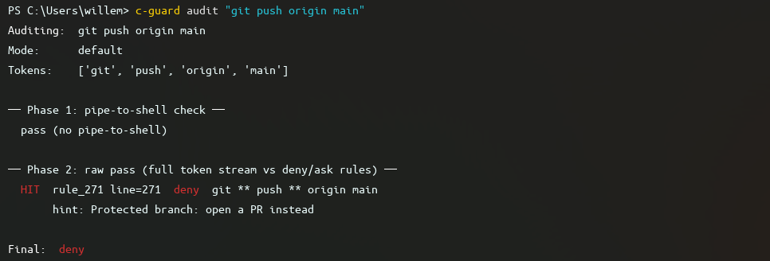
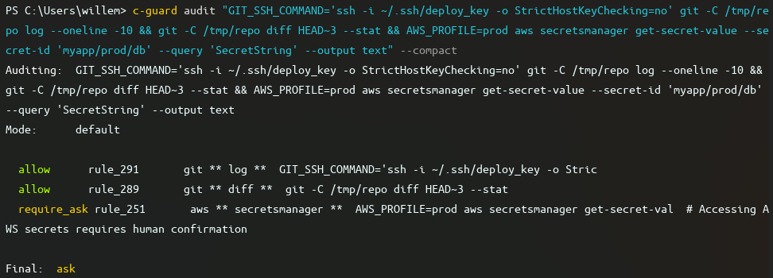
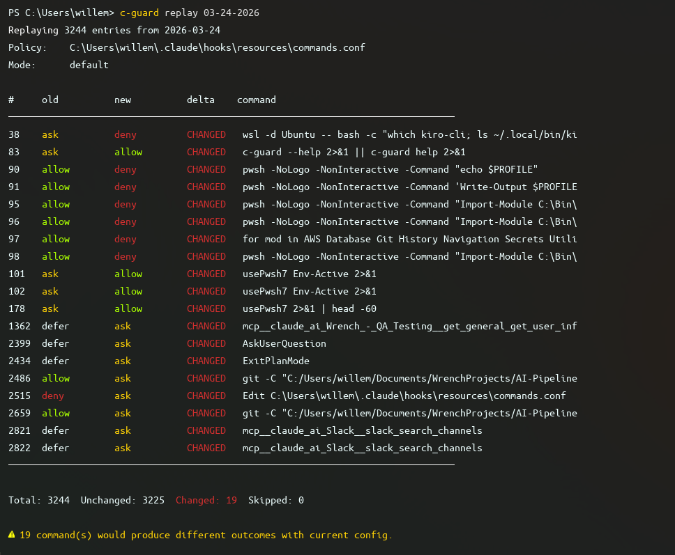
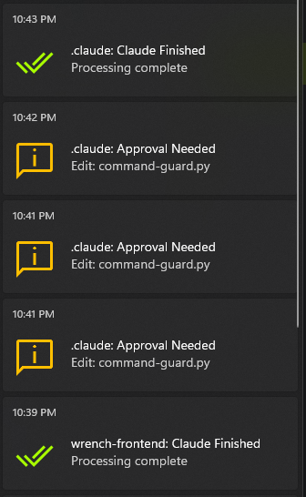

# Claude Code Hooks Setup

A set of Claude Code hooks and agent instruction files that gate Bash and tool calls before execution, fire desktop notifications, inject delegation reminders, and log all activity.

## Requirements

**System dependencies:**
- Python 3 available as `python3` or `python` on PATH (used by the `.sh` wrappers)

**Python packages** (install once):
- `windows_toasts` — Windows desktop notifications
- `plyer` — Linux/macOS desktop notifications

```
pip install windows_toasts   # Windows
pip install plyer            # Linux/macOS
```

**Claude Code version:** Requires hook support (PreToolUse, PostToolUse, Stop, Notification, Elicitation events).

## Directory Structure

```
~/.claude/
├── README.md
├── settings.json                      # hook wiring and permissions
├── agents/
│   └── *.md                           # agent instruction files
└── hooks/
    ├── command-guard.sh               # .sh wrapper; delegates to .py
    ├── command-guard.py               # Bash and tool permission gate
    ├── hook-dispatcher.sh
    ├── hook-dispatcher.py             # agent-aware event router
    ├── claude-notify.sh
    ├── claude-notify.py               # desktop notifications
    ├── track-agent-tokens.sh
    ├── track-agent-tokens.py          # subagent usage logger
    ├── guard-gap-analysis.py          # log analysis utility
    ├── guard-test.ps1                 # PowerShell test runner
    ├── test_hooks.py                  # hook unit tests
    ├── hook_utils.py                  # shared logging utilities
    └── resources/
        ├── commands.conf              # unified permission policy (source of truth)
        ├── commands.json              # compiled rule cache (auto-generated)
        ├── base_hooks.json            # default hook event config
        ├── beebop_hooks.json          # beebop-specific event overrides
        └── *.png                      # notification icons
```

**Logs written to:** `~/.claude/custom_logs/`

| File | Written by | Contents |
|------|-----------|---------|
| `YYYY-MM-DD_commands.jsonl` | command-guard | Every Bash and tool decision: timestamp, command, tokens, decision (allow/deny/ask/defer), matched rule ID and line, hint, duration |
| `YYYY-MM-DD_tokens.jsonl` | track-agent-tokens | Every Agent subagent call: agent type, model, description, session, token counts (input/output/cache read/cache creation), tool use count, duration |
| `YYYY-MM-DD_notif.jsonl` | claude-notify | Every desktop notification: preset, title, message, repo, platform |
| `hook_errors.jsonl` | all hooks | Hook-level errors (not rotated; append-only) |

These logs are the primary tool for evaluating workflow quality after a session. `commands.jsonl` shows exactly what Claude ran and what the guard decided; `tokens.jsonl` shows the delegation cost of each subagent call. Together they let you answer: what did Claude actually do, what got blocked or questioned, and how expensive was the delegation strategy.

## Hooks

### command-guard (PreToolUse)

Gates every Bash command and Claude Code tool call before execution.

Rules are defined in `resources/commands.conf` using glob-pattern token matching. On first run (or when `commands.conf` changes) the Bash rules are compiled to `commands.json` and cached; the cache is validated by content hash on each invocation.

**Bash rule actions:**

| Prefix | Action |
|--------|--------|
| `[+]` | Allow unconditionally |
| `[-]` | Deny with reason |
| `[~]` | Ask in interactive mode; auto-allow in `dontAsk` / `bypassPermissions` |
| `[?]` | Always ask; deny in `dontAsk` / `bypassPermissions` (requires human) |

**Tool rule actions** (for non-Bash Claude Code tools):

| Prefix | Action |
|--------|--------|
| `$[+]` | Allow |
| `$[-]` | Deny |
| `$[~]` | Ask in interactive; auto-allow in non-interactive |
| `$[?]` | Always ask; deny in non-interactive |

Tool rules match against `ToolName` (e.g. `Read`, `Edit`, `Write`, `WebFetch`, `Glob`, `Grep`) and an optional path pattern. Omitting the path pattern matches any target.

**Wildcards** (Bash patterns and tool path patterns, all case-insensitive):

| Token | Meaning |
|-------|---------|
| `?` | Exactly one character |
| `*` | One argument (or any characters within a path token) |
| `**` | Zero or more whitespace-separated arguments |
| `{a,b,c}` | Brace expansion — expands to one rule per alternative at load time |

**Inline hints:** append ` #<text>` to any rule. For `[-]` rules the text is shown to Claude as the deny reason. For `[~]` / `[?]` rules it appears in the confirmation prompt.

**CLI mode** (`c-guard` shim calls `command-guard.py` directly):

```
c-guard audit "git push origin main"
c-guard audit "wsl -d Ubuntu -- bash -c whoami" --mode dontAsk
c-guard replay 03-24-2026
c-guard replay 03-24-2026 --mode bypassPermissions
c-guard verify
c-guard usage
```

**`audit`** — traces a single command through every evaluation phase and prints the final decision:

```
Auditing:  git push origin main
Mode:      default
Tokens:    ['git', 'push', 'origin', 'main']

── Phase 1: pipe-to-shell check ──
  pass (no pipe-to-shell)

── Phase 2: raw pass (full token stream vs deny/ask rules) ──
  HIT  rule_271 line=271  deny  git ** push ** origin main
       hint: Protected branch: open a PR instead

Final:  deny
```

Phases: (1) pipe-to-shell detection, (2) raw token pass against deny/ask rules, (3) tree-sitter sub-command extraction, (4) per-sub-command rule evaluation. The `--mode` flag simulates `dontAsk` or `bypassPermissions` to show how `[~]` and `[?]` rules escalate.



Add `--compact` to get one line per sub-command showing only the governing rule:



**`replay`** — re-evaluates every entry from a past `commands.jsonl` against the current policy and reports what changed:

```
Replaying 3244 entries from 2026-03-24
Policy:    ~/.claude/hooks/resources/commands.conf
Mode:      default

#     old          new          delta    command
────────────────────────────────────────────────────────
38    ask          deny         CHANGED  wsl -d Ubuntu -- bash -c "which kiro..."
83    ask          allow        CHANGED  c-guard --help 2>&1 || c-guard help 2>&1
90    allow        deny         CHANGED  pwsh -NoLogo -NonInteractive -Command ...
2515  deny         ask          CHANGED  Edit ~/.claude/hooks/resources/commands.conf
────────────────────────────────────────────────────────
Total: 3244  Unchanged: 3225  Changed: 19  Skipped: 0
```

Use this whenever you edit `commands.conf` — it shows exactly which past commands would now be decided differently, so you can catch over-permissive or over-restrictive changes before they affect a live session.



**`verify`** — parses `commands.conf`, reports syntax errors and conflicts, and writes `commands.json`.

**`usage`** — aggregates rule hit counts from all `commands.jsonl` logs to show which rules are active and which are dead.

Logs every live hook decision to `commands.jsonl`.

### hook-dispatcher (all events)

Reads `agent_type` from the hook payload and loads `resources/{agent_type}_hooks.json`. Falls back to `base_hooks.json` if no agent-specific file exists. If an `instruction` is configured for the current event, it is printed to stdout and returned to Claude Code.

Supported event names: `SessionStart`, `UserPromptSubmit`, `PreToolUse`, `PermissionRequest`, `PostToolUse`, `PostToolUseFailure`, `SubagentStart`, `SubagentStop`, `Elicitation`, `ElicitationResult`, `TaskCompleted`, `Stop`, `SessionEnd`.

Currently active: in Beebop sessions `PreToolUse` injects `"BEEBOP GUARD: Are you sure this should not be delegated to Kiro or codex?"` before every tool call.

### claude-notify (Stop / PermissionRequest / Elicitation / Notification)

Shows a desktop toast notification. Called by the `.sh` wrapper with:

```
claude-notify.py <preset> [detail] [error_snippet]
```

**Presets:**

| Preset | Title suffix | Trigger |
|--------|-------------|---------|
| `completed` | Claude Finished | Stop event |
| `approval` | Approval Needed | PermissionRequest — shows tool name and file/command |
| `elicitation` | Input Required | Elicitation — MCP server waiting for input |
| `notification` | Claude | Generic Notification event |
| `error` | \<hook\> failed | Internal hook error |

For `approval` events the message is enriched from the hook payload: Edit/Write shows the filename; Bash shows the first 80 characters of the command.

On Windows uses `windows_toasts` with AUMID `ClaudeCode` registered under `HKCU\Software\Classes\AppUserModelId\ClaudeCode`. On Linux/macOS uses `plyer`. Logs each notification to `notif.jsonl`.



### track-agent-tokens (PostToolUse — Agent tool only)

Fires after every Agent tool call where `subagent_type` is present in the payload. Logs the following fields to `tokens.jsonl`:

`ts`, `session_id`, `project` (cwd), `agent`, `model`, `description`, `status`, `agent_id`, `total_tokens`, `tool_uses`, `duration_ms`, `input_tokens`, `output_tokens`, `cache_read_tokens`, `cache_creation_tokens`.

## Configuration

### commands.conf

Single source of truth for all Bash and tool permissions. Format:

```
# Bash rules
[+] git **                          # allow all git commands
[-] git ** push ** --force **       # deny force push
[~] chmod ** +x **                  # ask interactively; auto-allow when autonomous
[?] ssh **                          # always ask; deny when running autonomously

# Tool rules
$[+] Read                           # allow Read for any path
$[-] Write $HOME/.ssh/**            # deny writes into .ssh
$[~] WebFetch https://**            # ask before any web fetch
```

`$VAR` and `${VAR}` in path patterns are expanded from the environment at load time.

### Agent-specific hook instructions

Create `resources/{agent_name}_hooks.json` modelled on `beebop_hooks.json`. The file maps event names to `{ "instruction": "text" }`. Set to `null` to disable an event.

```json
{
  "PreToolUse": { "instruction": "Reminder: delegate reads to Kiro." },
  "Stop": { "instruction": null }
}
```

## Utilities

**guard-gap-analysis.py** — analyses `commands.jsonl` logs and cross-references compiled rules to surface policy gaps:

```
uv run python hooks/guard-gap-analysis.py [--days N] [--top N] [--min N]
```

Reports:
- **Decision breakdown** — overall allow/deny/ask/defer split across the time window
- **Coverage gaps** — commands that hit `defer` (no rule matched) repeatedly; these are candidates for new rules
- **Deny frequency** — most-blocked commands; may indicate rules that are too aggressive
- **Ask candidates** — commands routinely approved via `[~]` asks; candidates for promotion to `[+]`
- **Rule hit frequency** — which rules are firing most and which are never hit (dead rules)

Run this after a few days of normal use to drive the first round of `commands.conf` tuning. Pair with `c-guard replay` to verify the tuned config against the same history before committing it.

## Troubleshooting

- **No notifications on Windows:** `pip install windows_toasts`. Check `hook_errors.jsonl`.
- **No notifications on Linux/macOS:** `pip install plyer`. Check `hook_errors.jsonl`.
- **command-guard not evaluating correctly:** Run `c-guard audit "<command>"` to trace the decision. Run `command-guard.py --verify` to validate `commands.conf` syntax.
- **Hook not firing:** Verify `settings.json` has the correct absolute path to the `.sh` wrapper.
- **All hook errors:** `~/.claude/custom_logs/hook_errors.jsonl`.